---
## Front matter
title: "Лабораторная работа №2"
subtitle: "дисциплина: Архитектура компьютера"
author: "Гаврилейко Алина Александровна"

## Generic otions
lang: ru-RU
toc-title: "Содержание"

## Bibliography
bibliography: bib/cite.bib
csl: pandoc/csl/gost-r-7-0-5-2008-numeric.csl

## Pdf output format
toc: true # Table of contents
toc-depth: 2
lof: true # List of figures
lot: true # List of tables
fontsize: 12pt
linestretch: 1.5
papersize: a4
documentclass: scrreprt
## I18n polyglossia
polyglossia-lang:
  name: russian
  options:
	- spelling=modern
	- babelshorthands=true
polyglossia-otherlangs:
  name: english
## I18n babel
babel-lang: russian
babel-otherlangs: english
## Fonts
mainfont: IBM Plex Serif
romanfont: IBM Plex Serif
sansfont: IBM Plex Sans
monofont: IBM Plex Mono
mathfont: STIX Two Math
mainfontoptions: Ligatures=Common,Ligatures=TeX,Scale=0.94
romanfontoptions: Ligatures=Common,Ligatures=TeX,Scale=0.94
sansfontoptions: Ligatures=Common,Ligatures=TeX,Scale=MatchLowercase,Scale=0.94
monofontoptions: Scale=MatchLowercase,Scale=0.94,FakeStretch=0.9
mathfontoptions:
## Biblatex
biblatex: true
biblio-style: "gost-numeric"
biblatexoptions:
  - parentracker=true
  - backend=biber
  - hyperref=auto
  - language=auto
  - autolang=other*
  - citestyle=gost-numeric
## Pandoc-crossref LaTeX customization
figureTitle: "Рис."
tableTitle: "Таблица"
listingTitle: "Листинг"
lofTitle: "Список иллюстраций"
lotTitle: "Список таблиц"
lolTitle: "Листинги"
## Misc options
indent: true
header-includes:
  - \usepackage{indentfirst}
  - \usepackage{float} # keep figures where there are in the text
  - \floatplacement{figure}{H} # keep figures where there are in the text
---

# Цель работы

Целью работы является изучить идеологию и применение системы контроля
версий. Приобрести практические навыки по работе с системой git

# Задание

На основе методических указаний провести работу с базовыми командами
системы контроля версий git, выучить применение команд для разных случаев
использования, настроить GitHub.

# Теоретическое введение

Системы контроля версий (Version Control System, VCS) применяются при
работе нескольких человек над одним проектом. Обычно основное дерево проекта
хранится в локальном или удалённом репозитории, к которому настроен доступ для
участников проекта. При внесении изменений в содержание проекта система контроля
версий позволяет их фиксировать, совмещать изменения, произведённые разными
участниками проекта, производить откат к любой более ранней версии проекта, если
это
требуется.
В
классических
системах
контроля
версий
используется
централизованная модель, предполагающая наличие единого репозитория для
хранения файлов. Выполнение большинства функций по управлению версиями
осуществляется специальным сервером. Участник проекта (пользователь) перед
началом работы посредством определённых команд получает нужную ему версию
файлов. После внесения изменений, пользователь размещает новую версию в
хранилище. При этом предыдущие версии не удаляются из центрального хранилища и
к ним можно вернуться в любой момент. Сервер может сохранять не полную версию
изменённых файлов, а производить так называемую дельта-компрессию — сохранять
только изменения между последовательными версиями, что позволяет уменьшить
объём хранимых данных. Системы контроля версий поддерживают возможность
отслеживания и разрешения конфликтов, которые могут возникнуть при работе
нескольких человек над одним файлом. Можно объединить (слить) изменения,
сделанные разными участниками (автоматически или вручную), вручную выбрать
нужную версию, отменить изменения вовсе или заблокировать файлы для изменения.
В зависимости от настроек блокировка не позволяет другим пользователям получить
рабочую копию или препятствует изменению рабочей копии файла средствами
файловой системы ОС, обеспечивая таким образом, привилегированный доступ
только одному пользователю, работающему с файлом.

# Выполнение лабораторной работы

## Настройка GitHub

Создаю учетную запись на сайте GitHub, заполняю данные учетной записи и создаю аккаунт (рис. [-@fig:001]).

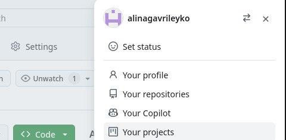{#fig:001 width=70%}

Открываю виртуальную машину, затем терминал и делаю предварительную конфигурацию Git. Вбиваю команду git config –global user.name ‘’, указываю свое имя и фамилию (рис. [-@fig:002]).

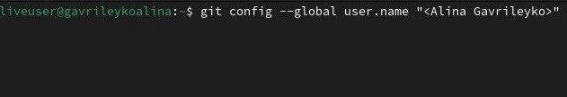{#fig:002 width=70%}
 
затем пишу команду git config –global user.email ‘’, указываю почту владельца. (рис. [-@fig:003]).

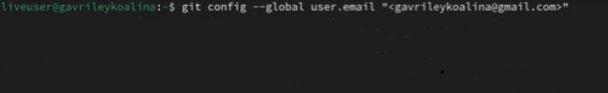{#fig:003 width=70%}

Настраиваю utf-8 в выводе сообщений git для корректного отображения символов (рис. [-@fig:004]).

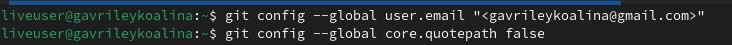{#fig:004 width=70%}

Задаю имя master для начальной ветки (рис. [-@fig:005]).

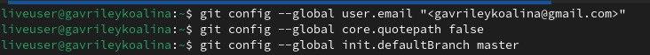{#fig:005 width=70%}

Задаю параметр autocrlf со значением input (рис. [-@fig:006]).

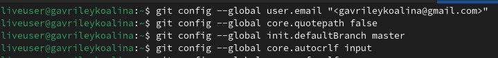{#fig:006 width=70%}

Задаю параметр safecrlf (рис. [-@fig:007]).

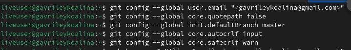{#fig:007 width=70%}

## Создание SSH-ключа

Для идентификации пользователя на сервере репозиториев нужно
сгенерировать пару ключей – приватный и открытый. Для этого в терминал ввожу
команду ssh-keygen –C ‘Имя Фамилия, work@email’ и ввожу туда имя, фамилию,
почту. Ключ автоматически сохранится в каталоге ~/.ssh/. (рис. [-@fig:008]).

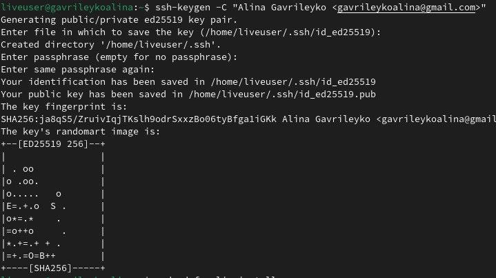{#fig:008 width=70%}

Далее на дистрибутив fedora необходимо скачать команду xclip. Устанавливаю ее с
помощью команды sudo dnf install xclip (рис. [-@fig:009]).

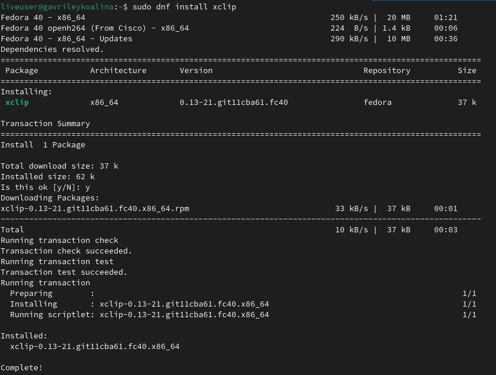{#fig:009 width=70%}

Копирую открытый ключ из директории, в которой он был сохранен, с помощью
команды xclip (рис. [-@fig:010]).

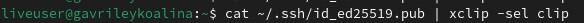{#fig:010 width=70%}

Далее захожу на сайт GitGub, открываю свой профиль и выбираю страницу “SSH
and GPG keys”. Нажимаю на кнопку “New SSH key”, вставляю в поле
скопированный ключ, в поле ‘Title’ указываю имя ключа, затем нажимаю “Add SSH-
key”. (рис. [-@fig:011]).

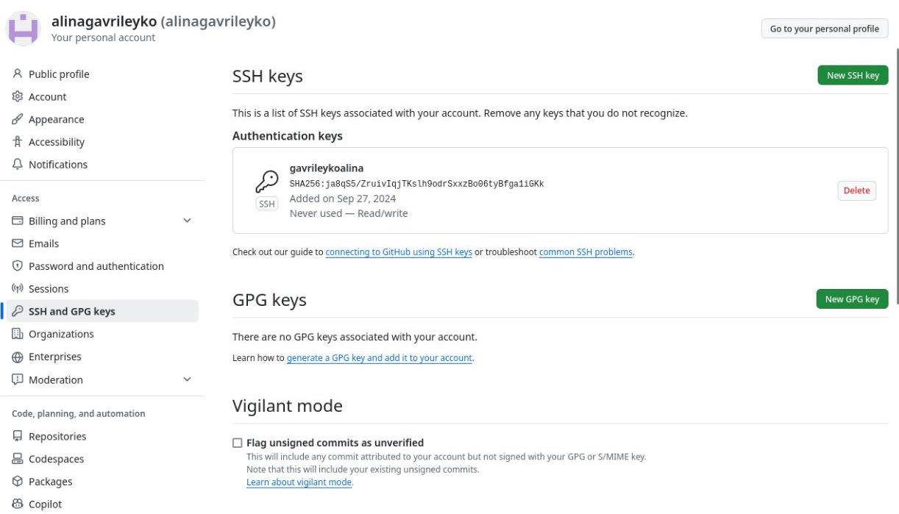{#fig:011 width=70%}

## Создание рабочего пространства и репозитория курса на основе шаблона

Открываю терминал, создаю директорию, рабочее пространство с помощью утилиты
mkdir, с помощью ключа –p создаю рекурсивно все директории после домашней
~/work/study/2024-2025/”Архитектура компьютера”. (рис. [-@fig:012]).

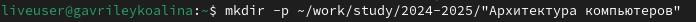{#fig:012 width=70%}

В браузере перехожу на страницу репозитория с шаблоном курса по адресу
https://github.com/yamadharma/course-directory-student-template, выбираю use this
template, чтобы использовать данный шаблон для своего репозитория. В
открывшемся окне задаю название репозитория: study_2024-2025_arch-pc и создаю
репозиторий, нажимая на кнопку “Create repository” (рис. [-@fig:013]).

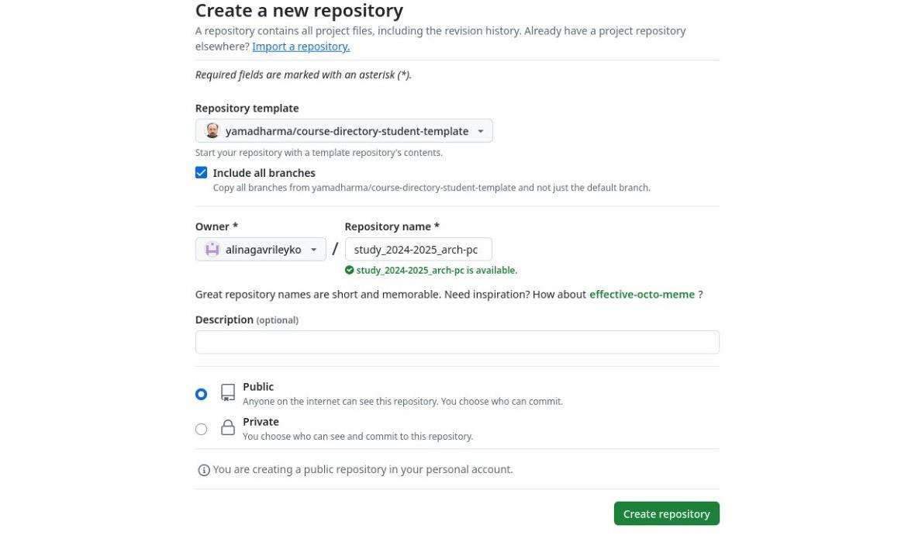{#fig:013 width=70%}

Через терминал перехожу в созданный каталог курса с помощью утилиты cd (рис. [-@fig:014]).

{#fig:014 width=70%}

Далее клонирую созданны	 репозиторий (рис. [-@fig:015]).

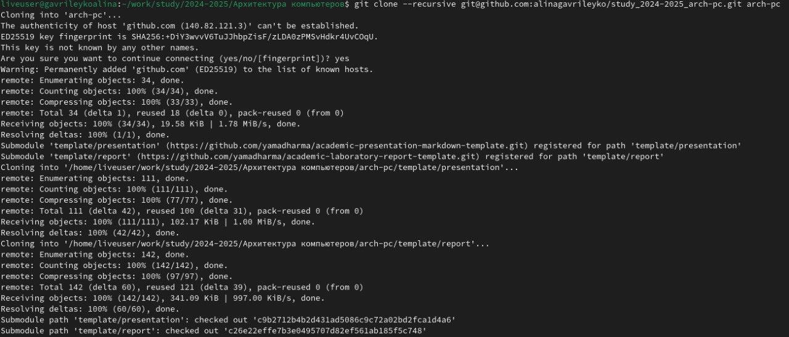{#fig:015 width=70%}

Ссылку для клонирования копирую на странице созданного репозитория, перейдя
сначала в окно ‘code’, выбрав затем вкладку ‘SSH’ (рис. [-@fig:016]).

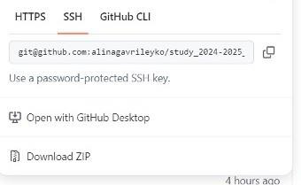{#fig:016 width=70%}

## Настройка каталога курса

Перехожу в каталог arch-pc с помощью утилиты cd (рис. [-@fig:017]).

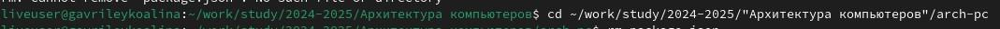{#fig:017 width=70%}

Удаляю лишние файлы с помощью утилиты rm (рис. [-@fig:018]).

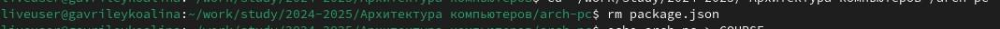{#fig:018 width=70%}

Создаю необходимые каталоги (рис. [-@fig:019]).

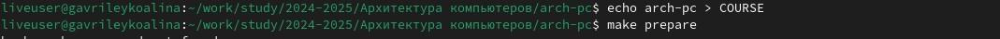{#fig:019 width=70%}

Отправляю созданные каталоги с локального репозитория на сервер: добавляю все
созданные каталоги с помощью git add, комментирую и сохраняю изменения на
сервере как добавление курса с помощью git commit (рис. [-@fig:020]).

{#fig:020 width=70%}

Затем все отправляю на сервер с помощью команды git push (рис. [-@fig:021]).

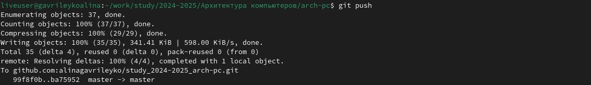{#fig:021 width=70%}

## Задания для самостоятельной работы

Перехожу в директорию labs/lab02/report, создаю в каталоге файл для отчета по
второй лабораторной работе с помощью команды touch (рис. [-@fig:022]).

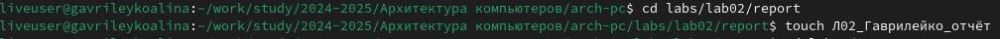{#fig:022 width=70%}

Перехожу в подкаталог lab01/report, затем копирую первую лабораторную работу с
помощью команды cp, а далее с помощью ls удостоверяюсь, что скопировано все
верно (рис. [-@fig:023]).

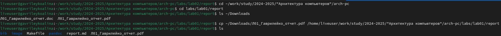{#fig:023 width=70%}

С помощью команды git add добавляю в коммит файл «Л01_Гаврилейко_отчет»,
перехожу в директорию, в которой находится отчет, добавляю нужный файл и
сохраняю изменения на сервере с помощью команды git commit –m ‘’ и далее с
помощью git push –f origin master отправляю изменения в главный репозиторий (рис. [-@fig:024]).

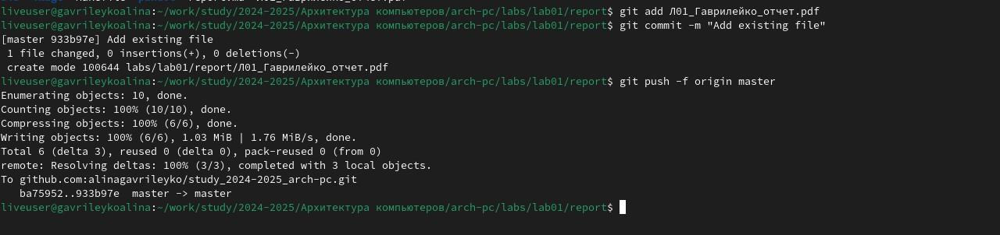{#fig:024 width=70%}

## Вывод

При выполнении данной лабораторной работы я изучила практические
навыки по работе с системой Git, изучила применение и идеологию средств
контроля версий.

## Список литературы 

https://esystem.rudn.ru/pluginfile.php/2089082/mod_resource/content/0/%D0%9B%D0%
B0%D0%B1%D0%BE%D1%80%D0%B0%D1%82%D0%BE%D1%80%D0%BD%D0
%B0%D1%8F%20%D1%80%D0%B0%D0%B1%D0%BE%D1%82%D0%B0%20%E2
%84%962.%20%D0%A1%D0%B8%D1%81%D1%82%D0%B5%D0%BC%D0%B0%2
0%D0%BA%D0%BE%D0%BD%D1%82%D1%80%D0%BE%D0%BB%D1%8F%20%
D0%B2%D0%B5%D1%80%D1%81%D0%B8%D0%B9%20Git.pdf

# Выводы

Здесь кратко описываются итоги проделанной работы.

# Список литературы{.unnumbered}

::: {#refs}
:::
